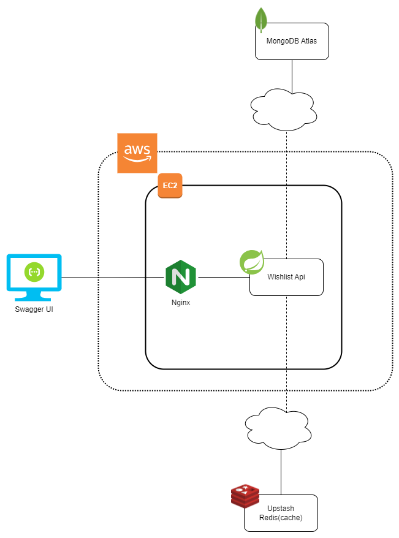

# Wishlist Api
[](https://github.com/leoferreiralima/wishlist/actions/workflows/ci.yaml)
[](https://github.com/leoferreiralima/wishlist/actions/workflows/release.yml)
[](https://sonarcloud.io/summary/new_code?id=leoferreiralima_wishlist)
[](https://sonarcloud.io/summary/new_code?id=leoferreiralima_wishlist)
[](https://sonarcloud.io/summary/new_code?id=leoferreiralima_wishlist)

Esta aplicação é projetada para fornecer um serviço de Wishlist para uma plataforma de e-commerce. Ela permite que os clientes adicionem, removam e visualizem produtos em sua Wishlist. Este serviço é construído para ser parte de uma arquitetura de microsserviços e foca exclusivamente na gestão da funcionalidade de Wishlist.

## Sumário
- [Tecnologias](#tecnologias)
- [Links Úteis](#links-úteis)
- [Features](#features)
- [Demo](#demo)
- [Rodar Local](#rodar-local)
- [Rodar Testes](#rodar-testes)
- [Arquitetura](#arquitetura)
- [Sugestões de Melhorias](#sugestões-de-melhorias)
- [License](#license)

## Tecnologias

- **Java 17**
- **Spring Boot**
- **Jacoco**
- **Gradle**
- **MongoDB** (Banco de Dados Principal)
- **Redis** (Cache)
- **Docker**
- **Nginx**
- **Aws EC2**
- **Github Actions** (CI/CD)
- **Sonar Cloud** (Quality Gateway)


## Links Úteis

- [Swagger Prod](http://ec2-54-233-4-106.sa-east-1.compute.amazonaws.com/wishlist/v1/swagger-ui/index.html)

- [Report SonarCloud](https://sonarcloud.io/summary/overall?id=leoferreiralima_wishlist)

## Features

- **Adicionar Produto à Wishlist:** Clientes podem adicionar seus produtos preferidos à sua Wishlist.
    - O Cliente pode adicionar no máximo 20 Wishlists.

- **Remover Produto da Wishlist**: Clientes podem remover produtos da sua Wishlist.

- **Visualizar Wishlist**: Clientes podem visualizar todos os produtos em sua Wishlist.


- **Verificar Produto na Wishlist**: Clientes podem verificar se um produto específico está em sua Wishlist.

## Demo

Essa aplicação está rodando em um EC2 na AWS. [Clique aqui para acessar o swagger](http://ec2-54-233-4-106.sa-east-1.compute.amazonaws.com/wishlist/v1/swagger-ui/index.html)


## Rodar Local

**Pré-Requisito:** Docker e Docker Compose

Faça um clone do Projeto

```bash
  git clone https://github.com/leoferreiralima/wishlist.git
```

Vá para a pasta do projeto

```bash
  cd wishlist
```

Suba os containers do docker

```bash
  docker-compose up -d
```

E pronto! Agora você pode acessar os recursos abaixo:

- [Swagger](http://localhost:8000/wishlist/v1/swagger-ui/index.html) - Para realizar as chamadas na aplicação

- [Mongo Express](http://localhost:8081) - Para visualizar as collections do Mongo

- [Redis Commander](http://localhost:8082) - Para visualizar os registros do Redis


## Rodar Testes

**Pré-Requisito:** Docker e Java 17

Para rodar os testes basta executar o comando abaixo

```bash
  .\gradlew build
```

Após o comando finalizar o report do Jacoco será gerado na pasta `/build/reports/jacoco/index.html`


## Arquitetura


## Sugestões de Melhorias

O projeto já possui uma excelente estrutura, mas sempre há espaço para melhorias. A seguir, estão listadas algumas sugestões para aperfeiçoamentos futuros:

- Logs (ELK, Sentry)
- Monitoramento e Observabilidade (Datadog, ELK, Dynatrace)
- Load Balancer e Auto Scaling (Aws)
- Integração entre os serviços de Produto e Usuário
- Autenticação (Token JWT)

## License

[MIT](https://choosealicense.com/licenses/mit/)
